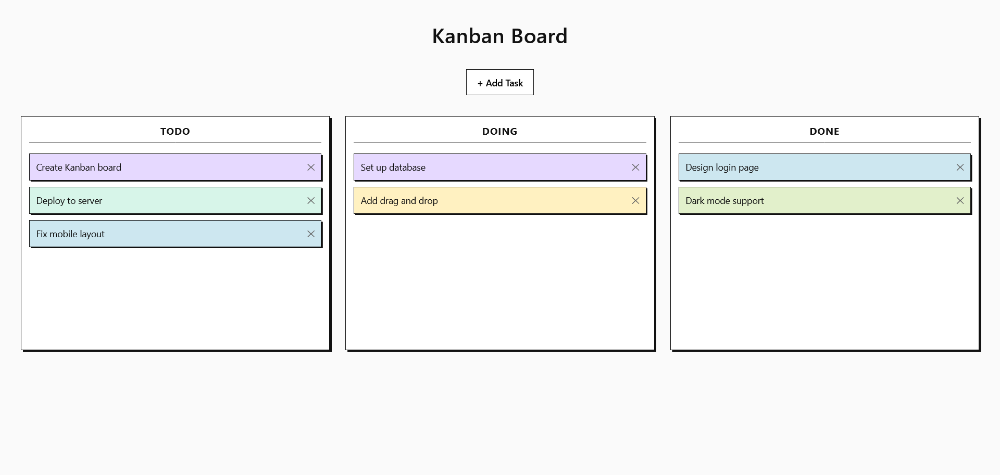

# scaling-umbrella

A fast and simple **Kanban board** built with **Flask**, designed to stay minimal, easy to review, and under **100 lines of code**.



## Features

- 📩 **Drag-and-drop**
- 💾 **Fast web UI** that renders in milliseconds
- ✍️ **Simple three-swimlane board**
- 🚀 **Lightweight Flask app**
- 🗄️ **No complicated database setup** — uses SQLite only
- 📦 **Minimal dependencies**

## One-liner Installation

```bash
git clone https://github.com/baguswjksn/scaling-umbrella.git && cd scaling-umbrella && rm Kanban.png README.md && pip install flask && python app.py
```

or if you use python3 and pip3

```bash
git clone https://github.com/baguswjksn/scaling-umbrella.git && cd scaling-umbrella && rm Kanban.png README.md && pip3 install flask && python3 app.py
```
> now you can acces it by entering default pass secret123